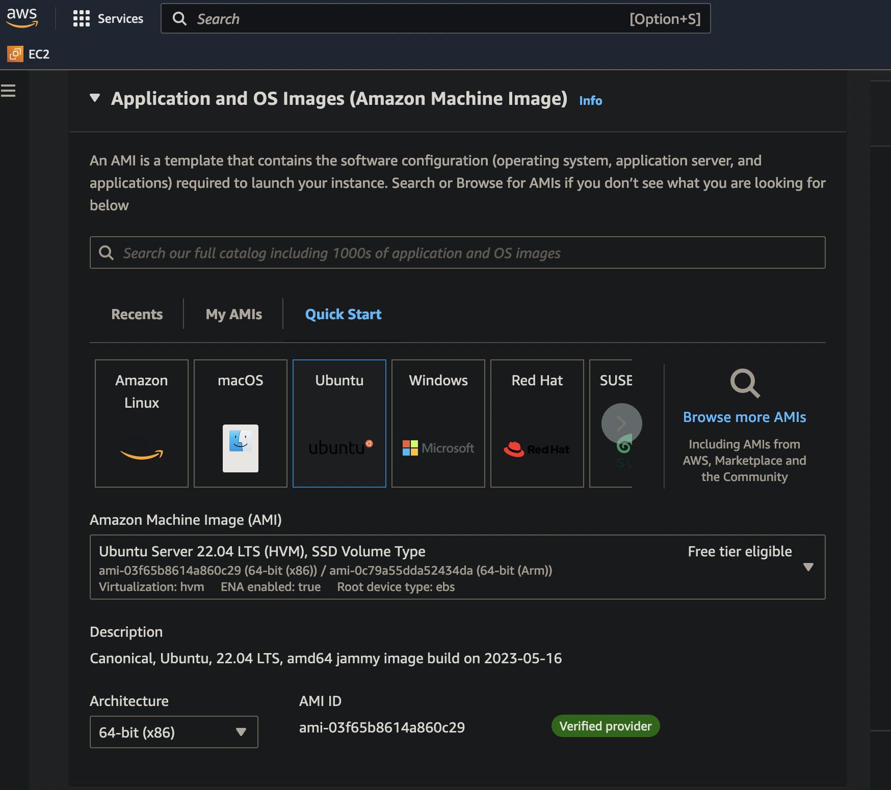

# nanogpt-lesson

## Introduction

The goal of this lesson is to teach the reader on how to deploy a custom AI
language model (think ChatGPT) on you own AWS EC2 server.
The following pre-requisite knowledge is required:

1. Familiarity with AWS EC2 service
2. Navigate the linux command-line
3. Some knowledge of python
4. Basic understanding of web server technology (we will be using Apache)

## Step 1 - Setup server

Launch a new server instance on EC2.  For this exercise, pick 
"Small T2 instance" of Ubuntu Server 22.04 LTS.



Make sure that the firewall security allows SSH (22),  HTTP (80), and HTTPS (443).

## Step 2 - Install Python

Both training and using the AI model requires python, so we need to make sure
the proper version of python is installed properly on our server.

SSH into your server from step 1.  The first thing you'll noticed is that
Ubunutu doesn't have the python command available.  Instead, it has the python3
command.  The details of why it's setup this way is beyound the scope of this
tutorial.  For now, execute the following command to make the python command call
python3.

```
$ sudo apt install python-is-python3
# we might as well install pip, since pip is not installed by default
$ sudo apt install python3-pip
```

## Step 3 - Install the AI tools

Now that the basic set is complete, we are ready to install the AI
tools for training and generating languages.  AI, in particular GPT-type
language model is a big and complex topic that spans entire careers, so I
obviously cannot get into any meaningful details.  Luckily, we don't necessarily
have to understand the internals of AI to train our own.  Thanks
to project like [nanoGPT](https://github.com/karpathy/nanoGPT "nanoGPT github").

NanoGPT consists of the following 3 python scripts:

- prepare.py: Prepare raw data into a format suitable for training.
- train.py: Performs the actual training and outputs an AI model.
- sample.py: Generate data using the AI model produced by train.py.

To install nanoGPT, you need to clone the code from github with the following
command:

```
# do this under the default ubuntu user
$ pwd
/home/ubuntu

# The actual command to clone the nanoGPT repository
$ git clone https://github.com/karpathy/nanoGPT.git

# nanoGPT requires the following additional libraries from pip
$ pip install torch numpy transformers datasets tiktoken wandb tqdm
```

## Step 4 - Run the scripts

We are finally ready to train our own AI model!  As mentioned in the
previous step, there are 3 scripts we need to run.

### Step 4.1 - Prepare the data

The first step is to run `prepare.py` to prepare the data.

The nanoGPT package contains a sharespeare's dataset for experimentation.
To run the prepare.py script for the sharespeare's dataset, issue
the following command:

```
$ python data/shakespeare_char/prepare.py
```

VERY IMPORTANT NOTE:  you'll noticed that the preapre.py script is stored under the
`data/sharespeare_char` sub-directory.  The way the software is setup, each
dataset will have it's own `prepare.py` script.  So if you want to download
and preapre you own data, you will need to create a new sub-directory under `data`,
copy over the `prepare.py` script and make the necessary modifications to `prepare.py`.

It's a good idea to look at the `prepare.py` script to see what it is doing.

If your script has executed successfully, you'll have a few more files in the `data/shakespeare_char`
directory, as follows:

```
$ ls -al data/shakespeare_char/
total 3296
drwxrwxr-x 2 ubuntu ubuntu    4096 Jul 19 19:43 .
drwxrwxr-x 8 ubuntu ubuntu    4096 Jul 19 22:02 ..
-rw-rw-r-- 1 ubuntu ubuntu 1115394 Jul 19 19:43 input.txt
-rw-rw-r-- 1 ubuntu ubuntu     703 Jul 19 19:43 meta.pkl
-rw-rw-r-- 1 ubuntu ubuntu    2344 Jul 19 19:43 prepare.py
-rw-rw-r-- 1 ubuntu ubuntu     209 Jul 19 19:43 readme.md
-rw-rw-r-- 1 ubuntu ubuntu 2007708 Jul 19 19:43 train.bin
-rw-rw-r-- 1 ubuntu ubuntu  223080 Jul 19 19:43 val.bin
```

The `input.txt` file is a freshly downloaded version of shakespeare work.  `meta.pkl`,
`train.bin` and `val.bin` are processed version of `input.txt`, ready to feed into
the training script.

### Step 4.2 - Train a new model

Training a new AI model can be extremely processor intensive.  A commercially trained model
such as ChatGPT [*requires access to a supercomputer with ~10,000 GPUs and ~285,000 CPU cores
and around 12-15 months of training time with such high resources.*](https://techcommunity.microsoft.com/t5/educator-developer-blog/chatgpt-what-why-and-how/ba-p/3799381).

Since we have 0 GPUs, only 1 CPU, and a few minutes, our training will not be optimal.  Issue
the following command to train our model:

```
$ python train.py config/train_shakespeare_char.py --device=cpu --compile=False --eval_iters=20 --log_interval=1 --block_size=64 --batch_size=12 --n_layer=4 --n_head=4 --n_embd=128 --max_iters=2000 --lr_decay_iters=2000 --dropout=0.0
```

Here we need to issue multiple command line argument to override the default training parameters.  The most
important one being `--device=cpu`, which instruct `train.py` to use cpu instead of GPU.

The training will run for 2000 iterations and takes a few minutes.

Another thing to note is that train.py takes as input another python script called `config/train_shakespeare_char.py`.
Every dataset can have it's only configuration which is written inside the `config/` sub-directory.  To train your
own data, you will need to create a new python file inside the `config/` sub-directory.

After the training is complete, the model will be written to the sub-directory `out-shakespeare-char`.

### Step 4.3 - Run the model

Now that we have a trained model, we can ask it to generate new data.  Run the following command:

```
$ python sample.py --out_dir=out-shakespeare-char --device=cpu --start='wherefore art thou'
```

The sample.py script will use the generated model to produce output.  Below is an example run:

```
$ python sample.py --out_dir=out-shakespeare-char --device=cpu --start='wherefore art thou'
Overriding: out_dir = out-shakespeare-char
Overriding: device = cpu
Overriding: start = wherefore art thou
number of parameters: 0.80M
Loading meta from data/shakespeare_char/meta.pkl...
wherefore art thou turser dush a dispeet all
Lord his maked his too mirtel and the death,
Were should adles a me do my day and my stray's they'd
Who his she down undubtioRancans, that the sain
Upont the be fathy coul prouse, and this tonged.
```

The `--start` arugment provides the prompt to the AI and the model will attempt to generate new text
based on this prompt.

A couple other interesting sample.py parameters you can override:

* --num_samples=<N> - controls how many completion to output.
* --seed=<N> - a random number.  Using the same seek would produce the same output given the same prompt.

## Step 5: Make the gerenation accessible from the web

Our `sample.py` can only be accessed via the command-line.  We can make it accessible via the web using the
following technique:

1. Install the apache webserver: `$ sudo apt install apache2`
2. Enable the cgid module: `$ sudo a2enmod cgid`
3. Open the ~ubunutu directory for the world: `chmod 755 ~`
4. Put the following bash script inside the `/usr/lib/cgi-bin/` directory with 755 permission:
```
#!/bin/bash

echo "content-type: text/plain"
echo
echo "Generating shakespeare..."
echo
# You will need to make sure the ~ubunutu directory is open for reading and execute
cd ~ubuntu/nanoGPT
python sample.py --out_dir=out-shakespeare-char --device=cpu --start='wherefore art thou' --num_samples=1 --seed=$RANDOM
```

If you done the above steps correctly, your script is now callable from the web via the url: `http://<your ip address>/cgi-bin/test`
